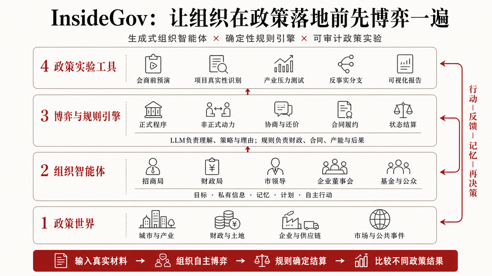

# InsideGov / 置身事内

[](https://github.com/lizhangxin666/insidegov/actions/workflows/ci.yml)
[](https://github.com/lizhangxin666/insidegov/releases)
[](https://www.python.org/)
[](LICENSE)

> 让政府部门、企业与规则在同一个世界中行动，把政策过程在现实发生前先跑一遍。

**InsideGov 是一个以组织为行动者、面向政企互动研究与政策演示的多智能体实验场。**
它把地方政府内部协调、企业策略、财政与土地约束、政策承诺、产业网络和市场周期放入
同一个可复现世界。大模型负责理解、规划、协商与理由表达；规则引擎负责财政扣减、
合同履约、项目进度、产能和信用等确定性状态更新。



## 现在可以解决什么问题

新首页按问题提供五个公众入口；复杂参数保留在研究工作台中。所有公众入口固定调用
DeepSeek Agent，只有研究工作台允许切换确定性基线、Flash 或 Pro。

| 入口 | 要回答的问题 | 可比较的策略 |
|---|---|---|
| 重大项目会商预演 | 怎样让部门冲突在承诺前暴露？ | 正式程序 / 非正式协调 / 混合模式 |
| 证据型项目尽调 | 没有答案标签时，一家新企业是否值得推进？ | 轻量筛查 / 独立核验 / 自适应尽调＋试点 |
| 产业政策压力测试 | 需求下滑后，困难企业应该救还是退？ | 市场退出 / 无条件救助 / 附条件救助 |
| 协商机制压力测试 | 同一句企业诉求，怎样问才不容易误签？ | 确认、会商和条件承诺机制组合 |
| 第一人称组织博弈 | 如果你坐进会场，会先采取什么行动？ | 招商 / 财政 / 市领导 / 园区角色体验 |

一次运行最终汇总四类宏观结果：

| 结果 | 关键变量 | 它回答什么 |
|---|---|---|
| 产业集聚 | `cluster_size`、供应商进入与退出 | 项目是否形成可持续产业链？ |
| 财政可持续性 | `fiscal_pressure`、承诺支出与 `rescue_spending` | 政府能否承担并持续兑现？ |
| 产能利用率 | `utilization`、`capacity`、`demand` | 产业增长是否演变为重复建设？ |
| 制度信誉 | `average_credibility`、履约与信用扩散 | 政府承诺是否形成长期信任？ |

## 核心架构

InsideGov 不是多个演示脚本的集合。招商、履约、集聚、模仿、退出和救助共享唯一的
`WorldState`，所有界面与叙事都是这个权威世界的投影。

```text
局部观察 + 私有信息 + 组织记忆
                ↓
CognitiveProvider
确定性策略 / DeepSeek：规划、协商、候选行动、理由
                ↓
OrganizationProcessEngine + OrganizationDynamics
正式程序、非正式联盟、机会窗口、开放行动编译
                ↓
ROLE_CAPABILITIES + GLOBAL_PROHIBITIONS
权限、信息边界、强制程序与禁止事项检查
                ↓
SimulationEngine
财政、合同、项目、市场、产能、信用的确定性结算
                ↓
WorldState + AgentActionAudit + WorldRepository
状态、审计、快照、分支、恢复与反事实比较
```

三个实现原则：

1. **LLM 负责想，模拟器负责算**：模型不能直接创造财政、土地、证据或产能。
2. **行为模板是脚手架，不是行动上限**：组织可提出目录外手段，但必须通过职责、权限、
   合法性和资源检查。
3. **客观状态与主观认知分离**：企业真实投资意愿、财政储备底线等私有信息不会自动共享。

### 组织 Agent

组织而非自然人是主要行动者。不同角色拥有不同能力集和禁止事项：

```python
investment = ROLE_CAPABILITIES[AgentRole.INVESTMENT]

investment.domains
# enterprise_contact / agenda_advocacy / pilot_design / ...

investment.resource_authorities
# propose_policy_package / request_coordination_time

investment.prohibitions
# approve_budget / modify_fiscal_floor / override_legal_review / ...

GLOBAL_PROHIBITIONS = {
    "create_money",
    "fabricate_evidence",
    "read_unauthorized_private_information",
    "rewrite_past_events",
    "directly_set_project_outcome",
}
```

因此招商局可以主动争取上级背书、建立行业联盟或提出分阶段试点，但不能批准预算；
财政局可以设定财政上限，但不能替企业决定选址；市领导可以启动程序和协调工具组合，
但不能绕过已核实的违法风险。

### 可审计行动链

每次关键行动都区分：

```text
Agent 当时看到什么
→ 原始结构化建议与理由
→ 权限/规则如何修正
→ 最终执行了什么
→ 世界状态怎样变化
→ Agent 事后如何复盘并更新组织记忆
```

`AgentActionAudit` 保存观察、私有信息使用情况、模型建议、规则调整、世界影响、模型名称、
重试与降级。研究者可以从均值下钻到单个 seed、季度和 Agent。

## 最新版本能力

当前 `main` 在 `v0.6.0` 的组织自主性基础上新增：

- **开放组织行动**：标准行为目录不再是上限，目录外行动可被编译为合法执行原语；
- **显式计划与长期学习**：保存计划树、实际行动、偏离原因、跨部门信任、组织惯例和领导更替；
- **内生机会窗口**：上级政策、重大会议、财政变化、竞争城市、舆情与负责人调整会改变议程；
- **证据型尽调**：Agent 看不到隐藏质量标签，自主选择调查顺序，并报告误签、误伤、Brier 与阈值曲线；
- **动态竞争闭环**：城市模仿招商、需求冲击、企业连续亏损、退出、附条件救助与僵尸企业；
- **问题优先的公众体验**：同一世界针对政府、企业与公众生成决策简报、响应报告或纪实故事；
- **可恢复后台任务**：长流程以独立 worker 运行，支持实时事件、心跳、检查点、安全停止和断点续跑；
- **P2 产品闭环**：历史节点复制、自然语言干预确认、Agent 访谈、自动报告和材料参数溯源。

详细设计见 [公众体验适配层](docs/PUBLIC_EXPERIENCE_ADAPTERS.md)、
[组织行动边界](docs/research/agent-action-boundaries.md)、
[证据型尽调研究](docs/DUE_DILIGENCE_RESEARCH.md) 和
[退出救助机制](docs/DYNAMIC_COMPETITION.md)。

## 快速开始

环境要求：Python 3.11+、[`uv`](https://docs.astral.sh/uv/)、Node.js 22+。

```bash
git clone https://github.com/lizhangxin666/insidegov.git
cd insidegov

uv sync --extra dev
cd apps/web && npm ci && cd ../..
```

公众入口必须配置 DeepSeek；未配置时服务端会明确返回 503，不会伪装成 AI 运行：

```bash
cp .env.example .env
# 在 .env 中填写 DEEPSEEK_API_KEY；不要提交该文件
set -a; source .env; set +a

make demo-stack
```

打开 <http://localhost:3000>。关闭网页不会中止已经启动的公众推演；任务、事件和检查点
保存在本地 `.insidegov/`，回到页面后可以继续查看。

如果只需要无 API Key 的可复现实验，可直接运行确定性研究命令：

```bash
# 完整生命周期
uv run insidegov run --quarters 16

# 五分钟可审计案例包与财政冲击反事实
uv run insidegov demo --seed 42 --fiscal-multiplier 0.5

# 正式、非正式和混合组织过程比较
uv run insidegov organization-compare --seed 42 --quarters 16

# 多策略、多 seed 与机制消融矩阵
uv run insidegov matrix --no-llm
```

研究工作台也可以分别启动：

```bash
uv run uvicorn insidegov.api:app --reload --port 8000
cd apps/web && npm run dev
```

## 实验与真实案例

- **合肥—蔚来案例**：公开参数卡、地方财政与联合产业基金分账、财政空间敏感性；
- **P1 实验矩阵**：确定性与 DeepSeek、多随机种子、机制消融、均值、方差与失败案例；
- **P2 反事实闭环**：从任意历史季度复制世界，只改变干预条件并继承随机状态；
- **协商实验室**：七种协商协议比较企业真实需求、第一轮表达与政府信念更新；
- **人才对接实验**：语言模式 × 中介平台的 2×2 反事实矩阵。

```bash
uv run insidegov case-hefei-nio --seed 42 --quarters 16
uv run insidegov case-hefei-nio-sensitivity --seed 42 --quarters 16
uv run insidegov negotiate-compare --seed 42
uv run insidegov talent-compare --seed 42
```

## 仓库结构

```text
src/insidegov/       权威世界、Agent、规则引擎、实验、API 与 CLI
apps/web/            问题优先的公众体验与研究工作台
configs/             可版本化实验配置
docs/                架构、案例、机制、实验与研究边界
tests/               可复现性、权限边界和状态转移测试
```

## 验证

```bash
make verify
```

该命令依次运行 Python Ruff/pytest，以及 Web lint、typecheck、渲染测试和生产构建。
GitHub Actions 对每个 PR 和 `main` 推送执行核心测试。

## 研究边界

InsideGov 是政策实验、程序压力测试与组织行为研究工具，不是现实政策预测器，也不是企业
信用评级系统。默认参数用于验证机制；现实应用必须提供参数来源、人工确认、历史案例校准、
多 seed、敏感性分析和外部验证。详见 [模型与结论边界](docs/MODEL.md)。

## 开源与安全

代码采用 [MIT License](LICENSE)。贡献前请阅读 [CONTRIBUTING.md](CONTRIBUTING.md) 和
[CODE_OF_CONDUCT.md](CODE_OF_CONDUCT.md)。`.env`、`.insidegov/`、日志、检查点与参考文献 PDF
默认不进入 Git。如果密钥曾在聊天、终端或截图中暴露，应在服务商控制台轮换；从 Git
删除密钥并不会让它失效。
