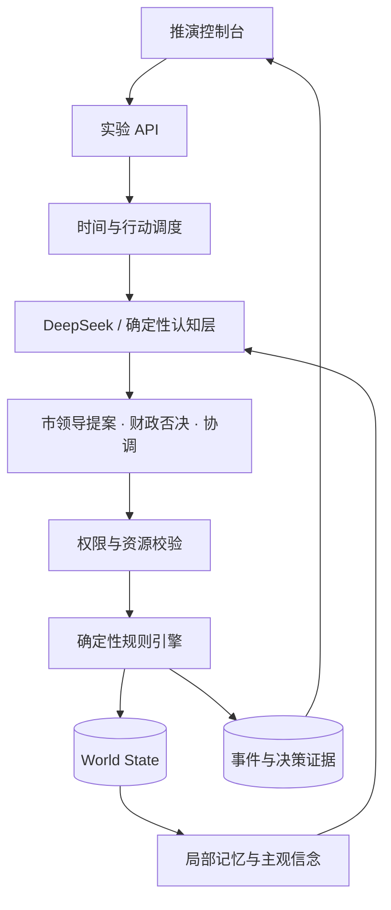

# 系统架构

InsideGov 采用“认知层提出行动、规则层验证并执行、事件层记录证据”的分层结构。

## 模块边界

- `models.py`：世界状态与结构化动作的数据契约；
- `agents.py`：私有观察下的结构化行动协议、DeepSeek 适配器与确定性降级；
- `policies.py`：可复现的招商提案基线；
- `engine.py`：财政、土地、合同、项目、市场和产业网络规则；
- `scenarios.py`：初始世界工厂，不包含预设结局；
- `experiments.py`：相同初始条件下的反事实分支；
- `calibration.py`：行为方向性校准任务；
- `repository.py` / `serde.py`：世界的原子持久化和类型化恢复；
- `api.py`：创建、推进、干预、复制和审计世界；
- `apps/web`：面向演示和研究的可视化控制台。

## 接入 LLM 的原则

`DeepSeekCognition` 只能返回通过 Pydantic Schema 验证的行动。引擎仍然负责权限、预算、合同和状态变更，并二次强制执行财政上限。外部模型不可直接修改 `WorldState`；请求或结构校验失败时，该步会自动降级为确定性认知层。
