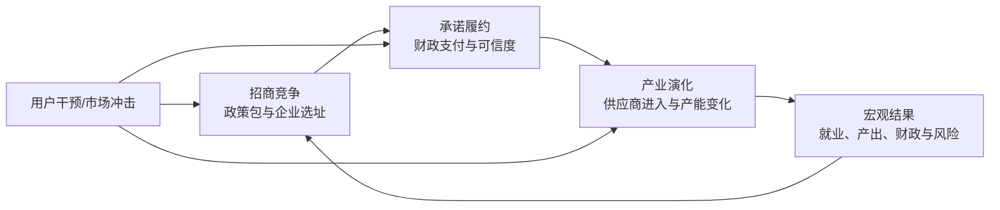
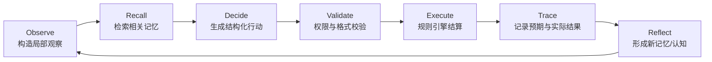

# InsideGov / 置身事内：完整产品文档

> 文档性质：产品需求文档（PRD）与产品单一事实源
> 产品版本：v0.5（当前实现）/ v0.6（下一目标）
> 文档版本：1.1
> 更新日期：2026-08-13
> 产品代号：InsideGov
> 开源协议：MIT

---

## 1. 产品摘要

### 1.1 一句话定义

InsideGov 是一个面向政府、园区、企业、研究者和教学者的政企互动多智能体政策实验场：它将地方政府组织、财政土地约束、企业异质性、政策承诺与产业网络转化为可运行、可干预、可复现的数字世界，用反事实实验理解微观互动如何涌现为宏观结果。

### 1.2 产品主张

**让 Agent 在政府与企业真正面对的约束中做选择。**

许多多智能体演示只展示“Agent 会交谈”，却无法回答：承诺要花多少钱、土地是否够用、财政局是否同意、项目能否按期推进、企业为什么改变投资意愿，以及同一政策在不同城市和市场条件下为何产生不同结果。

InsideGov 的核心不是增加更多对话，而是建立一套政企互动的可计算制度环境：

- 大模型负责理解信息、形成判断、协商、选择策略和表达理由；
- 确定性规则引擎负责财政扣减、土地占用、项目进度、产能增长、违约后果等状态更新；
- 每个 Agent 只拥有局部观察和私有信息；
- 每次决策都留下可检查的观察、理由、约束、行动和结果；
- 同一初始世界可以分叉为多个政策分支，用共同随机种子进行比较。

### 1.3 产品定位

InsideGov 首先是一个**政策推理与机制实验工具**，其次是一个**多智能体世界构建框架**，最后才是一个演示产品。

它不宣称预测现实世界的唯一未来，也不直接替代政府决策、企业投资判断或计量研究。产品输出应被理解为：在给定机制、参数和主体假设下，可能出现的行为路径、因果链与风险信号。

### 1.4 核心差异

| 维度 | 通用 Agent 模拟 | InsideGov |
| --- | --- | --- |
| 场景 | 开放式社交或通用角色扮演 | 中国地方政府—企业—产业链互动 |
| 决策约束 | 多依赖提示词 | 财政、土地、合同、项目和市场规则显式执行 |
| 政府主体 | 单一拟人化角色 | 市领导与财政部门分权、协调和否决 |
| 企业主体 | 同质化效用 | 龙头、供应商、机会型和技术型企业异质偏好 |
| 信息结构 | 常见全局上下文 | 私有事实、局部观察、独立认知与记忆 |
| 数值状态 | 可能由模型生成 | 仅由规则引擎结算 |
| 研究能力 | 重演示 | 种子、分支、干预、消融、校准、导出 |
| 输出目标 | 一个“故事” | 可追溯的机制链与可比较的实验结果 |

---

## 2. 背景与问题

### 2.1 现实问题

地方经济发展并非单个主体求最优的静态问题，而是多方在不完全信息和动态约束下不断博弈、协调与修正的过程：

- 地方政府既追求增长、就业和产业升级，也受财政、债务、任期和行政能力约束；
- 市领导、财政部门和执行部门的目标、信息和风险偏好并不一致；
- 企业对投资意愿、最低收益、迁移成本和真实产能拥有私有信息；
- 招商承诺会跨期影响财政空间和政府可信度；
- 龙头企业的落地会改变供应商预期、产业集聚和市场竞争；
- 同一政策可能因起点条件、市场冲击和执行能力不同而产生完全不同的后果。

传统静态表格难以表达主体协商和适应性行为；纯 LLM 角色扮演又难以保证数值一致、过程可复现和结论可比较。

### 2.2 用户痛点

1. **政策讨论缺少可运行载体**：政策方案通常停留在文本或单点测算，难以观察跨部门、跨主体和跨期反馈。
2. **Agent 演示缺少硬约束**：模型可以给出合理措辞，却可能随口生成预算、进度和结果。
3. **模拟结论不可追溯**：用户看到了曲线，却不知道变化源于哪条规则、哪个 Agent 的信息或哪次干预。
4. **实验难以复现**：模型、提示词、随机种子和参数未被完整记录，结果不能公平比较。
5. **真实材料进入门槛高**：地方产业报告、政策草案和访谈资料很难快速转成结构化世界配置。

### 2.3 产品机会

InsideGov 将制度机制、Agent 认知和实验工具连接起来，为以下任务提供共同底座：

- 解释一项政策为何在不同情境中表现不同；
- 提前发现财政、履约、可信度和产能扩张风险；
- 比较政策组合而非只讨论单一补贴额度；
- 训练学生理解地方政府、企业与产业链的动态关系；
- 为社会科学研究提供可复现的生成式 Agent 实验环境；
- 为比赛和公众展示提供一个可操作、可解释的政策沙盒。

---

## 3. 产品愿景、目标与边界

### 3.1 愿景

成为理解中国地方政企互动机制的开源数字实验基础设施：任何研究者都能从材料构建一个透明的世界，运行可复现的政策实验，并清楚说明结论依赖了哪些事实、机制和假设。

### 3.2 产品目标

- 用一个连续世界表达“招商竞争—承诺履约—产业演化”的完整因果链；
- 同时支持确定性认知和 LLM 认知，兼顾复现、成本与开放策略空间；
- 让主体异质性、私有信息和组织内部冲突成为一等公民；
- 为每个政策实验保留完整版本、参数、事件、决策和模型记录；
- 将复杂模拟包装为非技术用户也能完成的实验工作流；
- 形成可扩展的场景、规则、Agent 和指标插件接口。

### 3.3 非目标

以下内容不属于当前产品承诺：

- 不输出“某地未来一定会怎样”的确定性预测；
- 不自动生成可直接执行的现实政策命令；
- 不用虚构参数冒充真实城市数据；
- 不将 LLM 文本当作财政、法律或项目事实；
- 不以百万 Agent 数量作为首要竞争指标；
- 不在当前阶段建设真实城市级交通、人口和 GIS 全量数字孪生；
- 不未经授权上传或公开用户材料、模型密钥和受版权保护文献。

### 3.4 产品原则

1. **LLM 负责想，模拟器负责算。**
2. **客观状态与主观认知分离。** Agent 不应默认知道世界真值。
3. **组织不是一个人。** 政府和企业内部必须允许目标差异、审核、否决和协调。
4. **决策必须可追溯。** 不能只有结果曲线，没有行动证据链。
5. **实验必须可复现。** 种子、配置、代码、模型和干预共同定义一次实验。
6. **反事实优于单次故事。** 核心输出是分支差异，而不是最戏剧化的一次运行。
7. **机制声明与经验声明分开。** 默认参数只证明系统能运行，不证明现实有效。
8. **先做小而可信，再做大而热闹。** 优先强化领域机制、校准和闭环体验。

---

## 4. 用户与使用任务

### 4.1 核心用户

| 用户 | 主要任务 | 需要的结果 | 当前优先级 |
| --- | --- | --- | --- |
| 政策研究者/高校研究者 | 构造机制、运行对照实验、导出数据 | 可复现结果与方法说明 | P0 |
| 比赛评委/演示观众 | 快速理解产品价值并操作一次分支 | 5 分钟内看到因果差异 | P0 |
| 政府/园区研究人员 | 比较招商、履约和产业政策组合 | 风险链、权衡和讨论材料 | P1 |
| 企业战略/选址人员 | 观察不同城市承诺与信用的影响 | 情境比较，不是投资建议 | P1 |
| 教师与学生 | 学习地方政府和产业发展机制 | 可互动案例与课堂实验 | P1 |
| 开源开发者 | 增加场景、规则、Agent 或界面 | 清晰扩展点和测试规范 | P1 |

### 4.2 Jobs to Be Done

- 当我讨论一项政策时，我希望把隐含假设显式化并运行起来，以便发现口头讨论中遗漏的反馈链。
- 当我比较两个政策组合时，我希望它们共享相同初始状态和随机条件，以便差异尽可能来自政策本身。
- 当模拟出现意外结果时，我希望沿着事件和决策轨迹追溯原因，而不是接受一个黑箱结论。
- 当我使用 LLM Agent 时，我希望它只能看到角色应见的信息，而且不能直接改写世界状态。
- 当我引用模拟结果时，我希望同时导出版本、参数、模型、种子和日志，以便他人复核。
- 当我只有报告或政策草案时，我希望系统辅助提取实体、关系和参数，并让我确认后再创建世界。

---

## 5. 核心场景与世界生命周期

InsideGov 的三个场景不是互相独立的小游戏，而是同一世界的三个阶段。

### 5.1 场景一：多城市招商竞争

三座异质城市围绕目标企业提出包含补贴、土地、税收、人才和行政支持的政策包。企业根据自身偏好、真实投资意愿、风险承受能力和对政府可信度的主观判断选择落地城市。

关键问题：

- 城市会不会为了短期增长过度承诺？
- 财政部门会否否决领导提出的政策包？
- 企业会利用城市之间的信息差和竞争抬高要价吗？
- 财政实力较弱但产业基础较好的城市如何竞争？

### 5.2 场景二：政策兑现与承诺可信度

企业落地后，承诺进入跨期执行。财政支付、土地交付、行政支持和人才服务受当期资源与能力约束；延期或违约会影响不同企业对城市的主观可信度判断。

关键问题：

- 承诺何时成为财政负担？
- 一次违约如何扩散到未直接参与交易的企业？
- 客观履约率与企业感知可信度为何可能分离？
- 短期招商成功是否会换来长期信用损失？

### 5.3 场景三：产业补贴、企业进入与产能演化

龙头企业运营后，供应商根据市场规模、集聚效应、政策环境和可信度决定是否进入。需求周期、补贴强度和企业扩产共同影响产能利用率、利润、就业和地方产出。

关键问题：

- 补贴是在纠正协调失败，还是制造过剩产能？
- 龙头落地能否自然带来供应链集聚？
- 需求冲击下，不同政策组合如何影响企业退出与财政风险？
- 产业增长、财政可持续性和政府信用如何权衡？

### 5.4 横向研究场景

- 同一世界的基线与政策分支比较；
- 财政压力、市场需求和可信度冲击；
- 内部治理、信用扩散、供应链溢出等机制消融；
- 确定性认知与不同 LLM/提示策略的行为比较；
- 参数敏感性、批量种子与稳健性检验。

---

## 6. 产品状态与范围

状态说明：**已实现**表示 v0.5 可用；**部分实现**表示已有底层能力但仍有限制；**规划**表示目标需求。

### 6.1 v0.5 当前能力

| 模块 | 能力 | 状态 |
| --- | --- | --- |
| 世界 | 三城、多企业、供应商、三阶段连续状态 | 已实现 |
| Agent | 市领导、财政局、企业董事会可执行决策 | 已实现 |
| 认知 | 私有观察、记忆检索、结构化行动、复盘 | 已实现 |
| 治理 | 政策提案、财政审核/否决、协调缩减 | 已实现 |
| 政策 | 补贴、土地、税收、人才和行政支持组合 | 已实现 |
| 规则 | 财政、承诺、项目、信用、供应商和市场演化 | 已实现 |
| 实验 | 种子、单步/连续运行、干预、分支、消融 | 已实现 |
| 持久化 | 原子保存、重启恢复、世界列表 | 已实现 |
| 审计 | 事件流、谈判记录、决策轨迹、完整导出 | 已实现 |
| 模型 | 确定性认知、DeepSeek 兼容接口、失败降级 | 已实现 |
| 校准 | 财政风险敏感性、企业效用一致性任务 | 已实现 |
| 控制台 | 创建/恢复世界、推进、干预、分支、查看轨迹 | 已实现 |
| 报告 | 世界 HTML 报告、矩阵报告中心、seed/消融下钻、JSON 导出 | 已实现 |
| 材料导入 | 文本材料抽取、参数溯源、人工确认后建世界 | 部分实现（PDF/Word 需先转文本） |
| Agent 访谈 | 绑定指定季度快照与行动证据，区分当时已知/未知 | 已实现 |
| 演示 | 合肥—蔚来六步实时回放、共同随机数反事实、离线确定性模式 | 已实现 |
| 真实案例 | 公开参数卡、本级财政与三类联合产业基金、15%—35%敏感性 | 已实现 |

### 6.2 v0.6 目标范围

v0.6 的产品主题是：**从竞赛级政策实验工作台升级为可复用的研究设计器**。

- 通用实验设计器：选择自变量、范围、对照组、种子数、指标和停止条件；
- 本地任务队列：多参数组合排队、并发限制、暂停和断点恢复；
- PDF/Word 材料预处理与表格证据定位；
- 跨机器认知响应缓存持久化与严格 LLM 重放；
- 参数分布、敏感性曲线和不确定性区间；
- 场景模板与配置校验：支持开源贡献者添加新地区、新行业和新政策机制；
- 方法卡与世界卡：自动记录模型、代码版本、参数来源和校准状态。

### 6.3 后续范围

- 经验数据校准与参数后验分布；
- 更完整的政府部门和企业组织结构；
- 场景/规则插件 SDK；
- 多模型行为基准与认知偏差校准；
- 可选的地图、产业图谱与外部数据连接；
- 协作式实验项目、引用与公开复现实验包。

---

## 7. 端到端用户流程

### 7.1 快速演示流程（当前可用）

目标：新用户在 5 分钟内理解“政策分支为何导致不同结果”。

1. 打开控制台，系统恢复上次世界或创建默认世界；
2. 查看三座城市的预算、土地、信用与当前阶段；
3. 推进基线世界，观察政策提案、财政审核和企业选择；
4. 在关键节点创建反事实分支；
5. 对分支施加财政、需求或可信度冲击；
6. 同步推进基线与分支；
7. 比较就业、产出、预算、兑现率、信用和产能利用率；
8. 打开谈判记录与决策轨迹，解释差异来自何处；
9. 导出实验包。

### 7.2 研究者实验流程（当前可用，批量体验待增强）

1. 选择场景配置、随机种子、认知模式和模型；
2. 确认机制开关和核心参数；
3. 创建基线世界并运行到指定季度；
4. 从同一节点建立若干分支；
5. 分别施加政策或外生冲击；
6. 运行并比较关键指标、事件和 Agent 行为；
7. 执行机制消融和校准任务；
8. 导出完整状态、事件、轨迹与实验元数据；
9. 在论文、报告或课堂中说明模型假设与适用边界。

### 7.3 从材料创建世界（v0.5 文本版可用）

要求：

- 每个参数必须标记为“材料事实、外部数据、用户设定或系统默认”；
- 模型抽取不得未经确认直接成为实验事实；
- 缺失值应显式呈现，不得以看似精确的数字掩盖不确定性；
- 原始材料、抽取结果、用户修订和最终配置均应版本化；
- 受版权保护材料默认只在本地使用，不进入公开实验包。

### 7.4 Agent 访谈（v0.5 可用）

用户可在某个历史时点向 Agent 提问，例如：

- “你为什么否决这项补贴？”
- “你当时认为该城市兑现承诺的概率是多少？”
- “如果土地优惠减少 20%，你的选址会改变吗？”

回答必须绑定该时点的角色、私有观察、检索记忆和已记录决策。界面需明确区分：当时真实记录、基于记录的解释、以及新的反事实推理。

---

## 8. 信息架构与界面

### 8.1 一级信息架构

| 页面/区域 | 核心内容 | 主要用户动作 |
| --- | --- | --- |
| 项目首页 | 产品说明、示例世界、研究边界 | 新建或打开项目 |
| 世界构建器 | 场景模板、材料、实体、参数、来源 | 创建并校验世界 |
| 推演控制台 | 地图/主体、阶段、资源、时间轴、控制栏 | 推进、暂停、干预、分支 |
| Agent 面板 | 目标、私有信息、记忆、观察、行动 | 检查或访谈 Agent |
| 组织协商面板 | 提案、审核、否决、协调与最终方案 | 回看决策链 |
| 实验设计器 | 对照组、变量、种子、周期、指标、消融 | 配置批量实验 |
| 结果对比 | 指标、差异、关键事件、因果链 | 解释和筛选结果 |
| 报告与导出 | 方法卡、世界卡、图表、数据和限制 | 导出/分享实验包 |
| 模型与系统设置 | 认知模式、模型、密钥、存储、版本 | 配置运行环境 |

### 8.2 推演控制台布局

- 顶部：世界名称、分支、季度、阶段、运行状态、认知模式和版本；
- 左侧：城市/企业主体列表、资源概览与选中主体；
- 中部：世界关系视图、阶段进度和关键指标；
- 右侧：实时事件流、决策轨迹与告警；
- 底部控制栏：单步、连续、暂停、分支、干预、导出；
- 详情抽屉：谈判、承诺、项目、Agent 记忆和规则结算。

### 8.3 关键交互要求

- 任何指标变化都可跳转到相关事件与规则；
- 任何 Agent 行动都可查看其可见信息，而非事后全局信息；
- 创建分支时明确显示共同祖先和差异配置；
- 连续运行时允许安全暂停，且已完成步骤必须持久化；
- LLM 调用失败时明确标记降级，不得伪装为正常模型输出；
- 默认参数、用户参数和材料抽取参数使用不同视觉标记；
- “模拟结果”与“政策建议”在语言和视觉上严格区分。

---

## 9. 世界模型

### 9.1 核心实体

| 实体 | 作用 | 关键状态 |
| --- | --- | --- |
| World | 一次可运行世界及其完整历史 | ID、季度、阶段、种子、配置、父分支 |
| City | 地方政府及城市资源 | 预算、承诺、债务、土地、人才、产业基础、行政/环境容量、客观信用 |
| Department | 政府内部部门 | 目标、权限、资源、风险阈值 |
| Firm | 企业与供应商 | 类型、现金、投资、就业、产能、技术、风险、私有意愿、位置与项目进度 |
| Agent | 可执行认知主体 | 角色、目标、私有事实、性格、记忆、复盘 |
| PolicyPackage | 招商与产业政策组合 | 补贴、土地、税收、人才、行政支持、条件 |
| Promise | 跨期政策承诺 | 金额、到期、条件、状态、支付与违约 |
| Negotiation | 组织内部协商记录 | 提案、财政上限、关注点、协调方案、最终成本 |
| Intervention | 用户或外部冲击 | 类型、时点、参数、作用范围 |
| Event | 已发生的世界事件 | 时点、主体、类型、载荷、规则来源 |
| DecisionTrace | Agent 决策证据链 | 观察、记忆、目标、理由、行动、预期和结果 |
| MetricsSnapshot | 某时点聚合指标 | 产出、就业、财政、信用、兑现率、产能利用率等 |

### 9.2 状态分层

世界状态分为四层：

1. **客观状态**：预算、土地、项目进度、产能、合同状态等系统真值；
2. **主体私有状态**：真实投资意愿、财政底线、最低效用、风险容忍等；
3. **主体认知状态**：对信用、市场、对手和政策的主观判断；
4. **公共事件状态**：所有相关主体可观察的政策、落地、履约和市场事件。

规则引擎可读取结算所需真值，但 Agent 的提示上下文只能由其权限内的观察构造。

### 9.3 私有信息矩阵

| 信息 | 市领导 | 财政部门 | 企业董事会 | 其他企业 | 用户审计视图 |
| --- | --- | --- | --- | --- | --- |
| 城市公开预算与土地 | 可见 | 可见 | 可见摘要 | 可见摘要 | 可见 |
| 财政真实底线/压力阈值 | 不完全 | 可见 | 不可见 | 不可见 | 可见 |
| 企业真实投资意愿 | 不可见 | 不可见 | 自身可见 | 不可见 | 可见 |
| 企业最低效用 | 不可见 | 不可见 | 自身可见 | 不可见 | 可见 |
| 城市客观履约状态 | 可见 | 可见 | 依事件更新 | 依事件更新 | 可见 |
| 企业主观信用判断 | 不可见 | 不可见 | 自身可见 | 各自独立 | 可见 |
| 其他城市完整提案 | 依规则 | 依规则 | 可见收到的报价 | 不可见 | 可见 |

用户审计视图用于研究复核，不代表任何 Agent 能访问全局真值。

---

## 10. Agent 与决策协议

### 10.1 Agent 组织

当前执行主体包括：

- 城市领导 Agent：综合增长、就业、产业升级、任期与信用目标提出政策；
- 财政部门 Agent：依据私有财政底线和风险阈值审核政策成本；
- 企业董事会 Agent：依据企业类型、私有意愿、最低效用和主观信用选择投资地点；
- 供应商主体：依据龙头、市场、集聚、政策和风险决定进入与扩张。

后续可扩展发改、招商、自然资源、环保、银行、居民和媒体等主体，但新增角色必须拥有明确权限、信息来源和可执行动作，不能只是增加对话人数。

### 10.2 决策循环

### 10.3 结构化行动

认知层只能输出已定义的行动对象，例如：

- `OfferAction`：政策包各组成项、条件和理由；
- `FinanceAction`：批准、限制或拒绝，成本上限和关注点；
- `ResolutionAction`：领导对财政意见的接受、缩减或协调；
- `LocationAction`：企业选择城市、保留观望或拒绝，并给出效用依据。

行动在执行前必须通过模式、范围、权限和状态前置条件校验。任何自由文本都不能直接修改预算、土地、合同或项目状态。

### 10.4 认知模式

**确定性认知模式**

- 使用透明的启发式和效用规则；
- 相同配置与种子可稳定复现；
- 适合测试、校准、机制消融和低成本演示；
- 不追求开放式语言策略的丰富性。

**LLM 认知模式**

- 使用 OpenAI 兼容的 DeepSeek 接口生成结构化行动；
- 上下文仅包含角色可见观察、目标、私有事实和检索记忆；
- 使用严格 JSON Schema 解析与验证；
- 当前支持 `deepseek-v4-flash` 和 `deepseek-v4-pro` 配置；
- 单步调用异常时降级为确定性策略，并在轨迹中记录降级原因；
- 模型名称、参数和调用结果必须进入实验元数据。

### 10.5 异质性要求

异质性不能只写在人物简介中，必须进入实际决策函数。至少包括：

- 城市：财政能力、土地、人才、供应链、行政能力、环境容量、目标权重；
- 政府角色：增长偏好、风险承受、财政底线、任期压力；
- 企业类型：政策敏感、集聚敏感、信用敏感、风险承受、最低效用；
- 认知：对同一公共事件形成不同可信度更新；
- 记忆：不同主体检索到不同历史经验，并据此调整策略。

---

## 11. 规则引擎

### 11.1 职责边界

规则引擎是世界状态的唯一合法写入者。它负责：

- 时间与阶段推进；
- 政策包成本核算及财政约束；
- 土地占用、人才与行政容量约束；
- 承诺创建、到期、支付、延期、违约与条件判断；
- 项目开工、建设、投产和运营进度；
- 投资、就业、产能、利用率、利润和税收更新；
- 客观信用与企业主观信用传播；
- 龙头—供应商关系、进入、集聚和溢出；
- 市场需求、外生冲击和用户干预；
- 指标快照、事件与轨迹结果回填。

### 11.2 核心不变量

- 城市预算不得因普通结算变为非法负值；
- 土地使用不得超过可用土地；
- 同一承诺不能被重复支付；
- 项目阶段只能按允许的状态机迁移；
- 企业产能、就业和现金等状态应满足定义域约束；
- 用户干预必须记录时点、范围和参数；
- 分支创建后不得回写或污染父世界；
- 任何状态变化都必须对应规则事件或明确迁移原因。

### 11.3 冲突处理

当 Agent 行动违反约束时，系统按以下顺序处理：

1. 格式或权限错误：拒绝行动并记录；
2. 可修复范围错误：按显式规则裁剪，并记录原值与修正值；
3. 组织内部冲突：进入审核/协调流程；
4. 资源不足：延期、缩减或违约，由规则定义后果；
5. 无可执行行动：采用安全默认策略，并标注来源。

---

## 12. 实验系统

### 12.1 实验定义

一次完整实验至少由以下内容唯一确定：

- 世界/场景配置版本；
- 代码版本与规则版本；
- 随机种子；
- 认知模式、模型名称和模型参数；
- Agent 配置、提示模板版本和记忆策略；
- 机制开关；
- 初始状态、用户干预与外生冲击；
- 运行周期和停止条件；
- 指标定义版本。

### 12.2 分支与反事实

用户可从任意已持久化时点复制世界形成分支。分支继承此前全部状态和历史，但拥有独立 ID、父世界 ID、后续事件与干预。

公平比较要求：

- 分支共享相同共同祖先；
- 若研究政策效应，应尽量保持随机种子和其他配置一致；
- 界面与导出文件必须列出分支差异；
- 不把单次随机差异误表述为政策效应。

### 12.3 干预类型

当前内置：

- 财政冲击：改变城市可用预算或财政压力；
- 需求冲击：改变市场需求和产能利用；
- 可信度冲击：改变客观或主观信用状态。

后续扩展：土地供给、融资成本、环保约束、技术冲击、上级转移支付、人口/人才变化、企业退出与政策期限。

### 12.4 机制消融

当前机制开关包括：

- 私有信息；
- 政府内部治理；
- 可信度扩散；
- 供应链溢出。

消融实验用于回答“如果移除某机制，行为和结果是否显著改变”，是验证机制必要性而非现实真实性的工具。

### 12.5 校准与行为测试

当前基础任务：

- 财政风险敏感性：财政压力越高，政策批准上限应总体越低；
- 企业效用一致性：在给定观察下，企业应选择其评估效用最高的可行选项。

v0.6 应继续增加：

- 信用更新方向与幅度；
- 时间偏好与短期主义；
- 损失厌恶和沉没成本；
- 信息不对称下的策略性报价；
- 模型间、提示间和重复运行间的行为稳定性；
- 与问卷、访谈、案例或统计事实的外部校准。

### 12.6 核心指标

| 维度 | 指标示例 | 解释限制 |
| --- | --- | --- |
| 经济 | 总产出、投资、就业、税收 | 模拟单位，校准前非现实预测值 |
| 财政 | 可用预算、承诺余额、支付压力、债务风险 | 取决于成本与支付规则 |
| 履约 | 按期兑现率、延期额、违约数 | 需区分客观履约与主观感知 |
| 信用 | 城市客观信用、企业主观信用分布 | 由显式更新机制产生 |
| 产业 | 企业进入、供应商数量、产能、利用率、集聚度 | 对需求与溢出参数敏感 |
| 行为 | 提案强度、否决率、协调幅度、选址变化 | 用于解释宏观结果 |
| 实验 | 分支差异、跨种子均值/方差、敏感性 | 单次结果不能代表稳健效应 |

### 12.7 导出内容

完整实验包应包含：

- `manifest`：实验 ID、时间、版本、种子、模型和文件校验信息；
- 世界初始配置和最终状态；
- 全量事件、决策轨迹、谈判、承诺和指标历史；
- 干预、机制开关与分支关系；
- World Card、Model Card 和方法限制；
- 可供 Python/R 使用的结构化数据；
- 面向非技术用户的 HTML 报告（已实现）与 PDF 报告（规划）。

---

## 13. 功能需求与验收标准

### 13.1 世界管理

| ID | 需求 | 验收标准 | 状态 |
| --- | --- | --- | --- |
| WLD-01 | 创建世界 | 可指定种子、认知模式和模型，返回唯一 ID | 已实现 |
| WLD-02 | 保存与恢复 | 每步原子保存，服务重启后可继续 | 已实现 |
| WLD-03 | 世界列表 | 展示 ID、阶段、季度、模式和更新时间 | 已实现 |
| WLD-04 | 世界分支 | 从当前状态复制，记录父 ID，互不污染 | 已实现 |
| WLD-05 | 配置校验 | 非法参数在运行前给出定位明确的错误 | 部分实现 |
| WLD-06 | 材料构建世界 | 抽取结果经人工确认后生成配置和来源记录 | 已实现（文本材料） |

### 13.2 模拟运行

| ID | 需求 | 验收标准 | 状态 |
| --- | --- | --- | --- |
| SIM-01 | 单步推进 | 一次操作只推进定义明确的模拟步骤 | 已实现 |
| SIM-02 | 连续推进 | 可连续运行、停止，并持续更新界面 | 已实现 |
| SIM-03 | 阶段迁移 | 三阶段按状态条件迁移并保留历史 | 已实现 |
| SIM-04 | 硬约束 | 预算、土地、承诺和项目不变量有自动测试 | 已实现 |
| SIM-05 | 安全失败 | 错误不产生半写入世界，返回可诊断信息 | 已实现 |
| SIM-06 | 批量运行 | 可配置参数网格、种子数和并发队列 | 部分实现（固定矩阵、检查点续跑） |

### 13.3 Agent 与组织治理

| ID | 需求 | 验收标准 | 状态 |
| --- | --- | --- | --- |
| AGT-01 | 局部观察 | 测试证明私有信息不会进入无权 Agent 上下文 | 已实现 |
| AGT-02 | 结构化行动 | 所有行动通过类型与范围校验后执行 | 已实现 |
| AGT-03 | 内部审核 | 领导提案可被财政批准、限制或否决 | 已实现 |
| AGT-04 | 协调机制 | 审核后形成记录完整的最终方案 | 已实现 |
| AGT-05 | 记忆与复盘 | 行动后写入结果并可在后续检索 | 已实现 |
| AGT-06 | 模型降级 | LLM 失败时单步安全降级并留下标记 | 已实现 |
| AGT-07 | 历史访谈 | 回答绑定当时观察和记忆，区分记录与生成解释 | 已实现 |

### 13.4 实验与解释

| ID | 需求 | 验收标准 | 状态 |
| --- | --- | --- | --- |
| EXP-01 | 用户干预 | 干预具有类型、参数、范围和时间记录 | 已实现 |
| EXP-02 | 分支比较 | 可对比共同祖先世界的关键指标 | 已实现 |
| EXP-03 | 决策追踪 | 每个关键行动可查看观察、目标、理由和结果 | 已实现 |
| EXP-04 | 机制消融 | 开关机制后结果变化可测试与导出 | 已实现 |
| EXP-05 | 行为校准 | 校准任务可自动运行并返回通过/失败 | 已实现 |
| EXP-06 | 敏感性分析 | 参数范围、多种子与不确定性聚合 | 部分实现（案例参数范围与多种子矩阵） |
| EXP-07 | 自动报告 | 输出差异、关键链条、限制和复现信息 | 已实现（HTML/JSON） |

### 13.5 控制台与导出

| ID | 需求 | 验收标准 | 状态 |
| --- | --- | --- | --- |
| UI-01 | API 驱动 | 页面数据来自后端世界，不使用伪造静态结果 | 已实现 |
| UI-02 | 状态总览 | 展示阶段、城市资源、指标、事件和分支 | 已实现 |
| UI-03 | 运行控制 | 支持创建、恢复、单步、连续、干预、分支 | 已实现 |
| UI-04 | 深入解释 | 可查看谈判详情与完整决策轨迹 | 已实现 |
| UI-05 | 完整导出 | 可从界面下载世界实验数据 | 已实现 |
| UI-06 | 实验设计器 | 图形化定义对照、参数、种子、指标与停止条件 | 部分实现（固定矩阵与案例敏感性） |
| UI-07 | 报告中心 | 浏览、比较、引用和导出实验报告 | 已实现 |

---

## 14. API 与系统边界

### 14.1 当前公开 API

| 方法 | 路径 | 用途 |
| --- | --- | --- |
| GET | `/health` | 健康检查 |
| GET | `/capabilities` | 前端读取系统与模型能力 |
| POST | `/demos/hefei-nio` | 实时生成六步典型博弈与共同随机数反事实 |
| GET | `/cases/hefei-nio/sensitivity` | 获取案例财政空间与联合基金敏感性结果 |
| GET | `/experiment-reports` | 列出本地与随包发布的实验报告 |
| GET | `/experiment-reports/{id}` | 获取矩阵报告、seed 和消融明细 |
| GET | `/experiment-reports/{id}/download` | 下载报告 JSON |
| GET | `/experiment-reports/{id}/worlds/{world_id}` | 打开报告关联的完整世界快照 |
| GET | `/scenarios` | 场景列表 |
| GET | `/worlds` | 世界列表 |
| POST | `/worlds` | 创建世界 |
| GET | `/worlds/{id}` | 获取世界状态 |
| POST | `/worlds/{id}/step` | 推进世界 |
| POST | `/worlds/{id}/interventions` | 添加干预 |
| POST | `/worlds/{id}/branches` | 创建分支 |
| POST | `/worlds/{id}/branches/from-history` | 从指定历史季度复制世界 |
| POST | `/worlds/{id}/intervention-plans` | 将自然语言干预解析为待确认计划 |
| POST | `/worlds/{id}/intervention-plans/confirm` | 人工确认并执行干预计划 |
| POST | `/worlds/{id}/interviews` | 基于历史证据访谈指定 Agent |
| POST | `/worlds/{id}/reports` | 生成世界 HTML/JSON 报告 |
| GET | `/worlds/{id}/traces` | 获取决策轨迹 |
| GET | `/worlds/{id}/agents` | 获取 Agent 审计信息 |
| GET | `/worlds/{id}/export` | 导出完整实验数据 |
| GET | `/experiments/comparison` | 对比实验结果 |
| GET | `/experiments/ablations` | 获取消融结果 |
| POST | `/materials/candidates` | 从文本材料提取候选世界与参数来源 |
| POST | `/materials/candidates/{id}/confirm` | 人工确认参数后创建世界 |

### 14.2 模块边界

- **Web/API 层**只负责输入、展示和流程编排，不实现核心经济规则；
- **认知层**提出结构化行动，不直接写世界；
- **校验层**检查模式、权限、范围和状态前置条件；
- **规则层**是状态变化唯一入口；
- **存储层**负责原子持久化和恢复；
- **实验层**负责种子、分支、干预、消融、校准和比较；
- **审计层**保存观察、行动、规则结算、错误和降级记录。

详细设计见 [ARCHITECTURE.md](ARCHITECTURE.md)。

---

## 15. 非功能需求

### 15.1 可复现性

- 确定性模式下，相同代码、配置和种子必须产生相同结果；
- LLM 模式必须记录模型、参数、提示版本和原始结构化响应；
- 随机数来源集中管理，不允许模块隐式创建未记录随机源；
- 导出必须包含复现实验所需的最低充分元数据；
- 指标定义变更必须版本化。

### 15.2 可靠性与数据完整性

- 世界状态使用原子写入，避免中断产生损坏文件；
- 一步失败时不应保留部分规则结算；
- 服务重启后已完成步骤和分支关系可恢复；
- 导出前执行基本一致性校验；
- 重要 schema 变更需提供迁移或明确不兼容说明。

### 15.3 性能目标

本地确定性模式的优先目标：

- 创建默认世界：普通开发机上 2 秒内；
- 单步推进：普通开发机上 1 秒内；
- 控制台操作反馈：200 毫秒内呈现加载/运行状态；
- 100 个默认世界列表和恢复操作保持可用；
- LLM 模式不承诺固定推理时延，但必须提供超时、进度和降级反馈。

批量实验需要独立任务队列与资源限制，不得阻塞交互控制台。

### 15.4 安全与隐私

- 模型密钥只通过环境变量或本地安全配置读取，不写入 Git、日志或导出；
- 默认本地优先存储，用户明确授权后才接入远程服务；
- 发往模型服务的内容必须可预览，并尽量去除无关敏感信息；
- 用户上传材料默认私有，不自动纳入开源仓库；
- 审计导出可能包含 Agent 私有事实，导出界面需提示；
- 未来多人部署需增加认证、项目隔离、权限和审计日志。

### 15.5 可访问性与可解释性

- 关键状态不能只靠颜色表达；
- 图表提供标签、单位、定义和数据下载；
- 错误提示说明影响范围和恢复方式；
- 专有名词在界面提供简短解释；
- 自动报告始终包含“假设与限制”。

### 15.6 开源质量

- 代码、文档、配置、测试和示例共同版本化；
- 提交不得包含书籍 PDF、真实密钥和无授权数据；
- 新机制需同时提交定义、参数来源、测试和实验示例；
- 新 Agent 需声明目标、权限、私有信息、动作空间和失败策略；
- 新指标需声明公式、单位、聚合方式和适用边界。

---

## 16. 质量评估框架

“像真的”不是充分的质量标准。InsideGov 从四层评估：

### 16.1 软件正确性

- schema、状态机和核心不变量测试；
- API、存储恢复和前端构建测试；
- 相同种子复现；
- 分支隔离；
- 故障与降级测试。

### 16.2 行为有效性

- Agent 是否对激励、风险和信息变化做方向合理的响应；
- 异质主体是否产生可区分行为；
- 同一主体在近似条件下是否保持基本一致；
- 行为是否过度依赖措辞或模型随机性；
- 结构化动作与自然语言理由是否一致。

### 16.3 机制有效性

- 移除内部治理后，财政否决和承诺成本是否发生预期变化；
- 移除信用扩散后，未直接交易企业的判断是否不再被影响；
- 移除供应链溢出后，龙头落地是否不再自动改善供应商条件；
- 不同参数范围是否出现理论上可解释的临界点和非线性。

### 16.4 外部有效性

- 参数是否有现实数据、文献、案例或专家判断来源；
- 模拟模式能否复现已知典型事实或案例结构；
- 结论是否通过多种子、敏感性和替代设定检验；
- 输出是否清楚区分校准内解释与校准外推断。

### 16.5 发布门槛

每个正式版本至少满足：

- Python 测试、静态检查通过；
- Web 类型检查、Lint 和生产构建通过；
- 默认演示从创建到导出全流程通过；
- 变更日志、路线图和验收说明更新；
- 不含密钥、受版权材料或用户私有数据；
- 研究边界与已知限制未被删除或弱化。

---

## 17. 产品成功指标

产品处于研究原型阶段，成功不能只用访问量衡量。

### 17.1 北极星指标

**成功完成且可复现的反事实实验数**：实验需包含共同祖先、至少两个分支、明确差异、完整轨迹和可复现元数据。

### 17.2 体验指标

- 新用户首次创建并推进世界的完成率；
- 从进入控制台到看到第一次分支差异的时间；
- 能从指标定位到关键事件/决策的任务成功率；
- 导出实验包成功率；
- LLM 调用失败后可继续运行的比例。

### 17.3 研究质量指标

- 默认实验确定性复现通过率；
- 核心机制具有对应消融实验的覆盖率；
- 参数拥有来源/状态标记的覆盖率；
- 关键行为校准任务通过率；
- 报告包含限制、版本和种子的完整率；
- 外部贡献场景通过质量门槛的数量。

### 17.4 反指标

以下数字不能单独作为成功证明：Agent 数量、生成文本长度、运行轮数、视觉复杂度、单次曲线的“戏剧性”或未经校准的预测准确率。

---

## 18. 竞赛演示脚本

### 18.1 五分钟主线

**0:00—0:30，问题与入口。** 点击首页“进入五分钟演示”。招商政策不是一句“给补贴”，它会穿过财政审核、企业选择、承诺兑现和产业扩张。页面显示本次实时生成的两个 world ID，证明不是前端固定剧情。

**0:30—1:10，公开事实与信息边界。** 展示合肥—蔚来公开数据、参数来源和模型假设；切到企业与政府审计，强调没有角色看到全部真相。

**1:10—2:15，真实协商。** 企业表达后，招商局提出现金18.47亿元；财政局按私有储备底线压到9.54亿元并限制本级股权；市领导重组为本级财政工具＋53.52亿元联合基金＋分期兑现。打开“认知建议—规则修正—执行”证据链。

**2:15—3:10，合同与结算。** 展示八项承诺的资金来源、触发条件、到期季度和支付状态，说明规则引擎负责财政扣减、信用和项目进度。

**3:10—4:10，共同随机数反事实。** 基线和冲击世界继承Q3相同状态与随机数，Q4只把合肥可用财力乘以0.5；对比Q16就业、集群和信用，并下钻承诺延期事件。

**4:10—5:00，研究可信度。** 打开“实验结果”，从策略/消融均值下钻到单个seed和失败原因，再展示15%—35%财政空间敏感性与JSON导出；最后明确产品用于政策实验和机制探索，不是未来预测器。

### 18.2 演示成功条件

- 现场断网时确定性模式可完成全流程；
- LLM 只是增强项，失败不阻断演示；
- 预置一个差异明显但不夸张的分支案例；
- 所有图表能回到具体事件与决策；
- 结尾展示开源仓库、复现命令和下一版本路线。

---

## 19. 路线图

### v0.1：世界骨架（已完成）

- 三阶段连续世界；
- 城市、企业、政策、承诺和产业状态；
- 确定性规则与基础 CLI/API；
- 复现、约束和轨迹测试。

### v0.2：组织与认知（已完成）

- 市领导—财政部门—企业董事会 Agent；
- 私有观察、记忆、结构化行动与复盘；
- 内部审核和协调；
- DeepSeek 适配与安全降级；
- Web 实验控制台、持久化、分支、干预和导出；
- 初步校准与机制消融。

### v0.3：政策实验工作台（已完成）

- 材料到世界的构建向导；
- World Card、参数来源与不确定性标记；
- 实验设计器与批量运行；
- 多种子、敏感性和结果聚合；
- 自动对比报告与 Agent 历史访谈；
- 完整演示案例与研究复现包。

### v0.4：校准与场景生态（已完成）

- 现实数据/案例校准流程；
- 行为基准与多模型对比；
- 场景、规则和 Agent 插件接口；
- 更多产业与政府组织模板；
- 社区贡献规范、基准任务和公开实验库。

### v0.5：评委可验证演示闭环（当前版本，已完成）

- 合肥—蔚来六步典型博弈实时回放；
- 本级财政与联合产业基金分账审核和确定性结算；
- 共同随机数基线/财政冲击分支与因果链；
- 矩阵报告中心、seed/消融下钻、失败与降级检查；
- 15%—35%财政空间及联合基金机制敏感性；
- 离线确定性演示、自动化验收和复现命令。

### v0.6：通用研究设计器（下一阶段）

- 图形化参数网格、停止条件和任务队列；
- 通用参数分布、不确定性区间与敏感性曲线；
- PDF/Word 原文证据定位和材料预处理；
- 场景、规则和 Agent 插件接口及公开实验库。

详细研发任务见 [ROADMAP.md](ROADMAP.md)。

---

## 20. 风险与应对

| 风险 | 表现 | 应对 |
| --- | --- | --- |
| 过度宣称 | 把模拟路径包装成现实预测 | 固定研究边界、报告限制、禁止确定性预测措辞 |
| 参数幻觉 | LLM 生成看似精确但无来源的数值 | 参数来源标签、人工确认、缺失值显式化 |
| 行为不稳定 | 换模型或提示后结论大变 | 确定性基线、多次运行、行为校准、模型卡 |
| 私有信息泄漏 | Agent 获得不应知道的事实 | 观察构造器、权限测试、提示审计 |
| 数值失真 | LLM 直接改状态或规则不一致 | 状态唯一写入口、schema 校验、核心不变量 |
| 解释幻觉 | 事后访谈编造当时理由 | 绑定历史轨迹，区分记录、解释与反事实 |
| 演示大于研究 | 界面丰富但结论不可复核 | 复现、消融、校准和导出作为发布门槛 |
| 范围失控 | 追逐百万 Agent、GIS 等通用能力 | 聚焦政企机制与实验闭环，扩展采用插件化 |
| 数据与版权 | 上传材料进入日志或开源包 | 本地优先、明确授权、导出筛选、Git 忽略 |
| 成本与延迟 | LLM 调用昂贵或不可用 | 确定性模式、缓存/批处理、超时和单步降级 |

---

## 21. 产品决策与待验证问题

### 21.1 已确定决策

- 一个世界承载三个生命周期场景，不拆成三套互不相干的模拟；
- 规则引擎拥有状态写入权，LLM 只能输出候选结构化行动；
- 政府内部至少区分领导与财政部门；
- 主观可信度属于企业认知，不等同于城市客观信用；
- 默认提供确定性模式，LLM 是可替换认知插件；
- 产品用语为“政策实验、情境推演、机制探索”，不用“精准预测未来”；
- 近期重点是材料输入—实验—解释—报告闭环，不追求大规模 Agent 数量。

### 21.2 待验证问题

- 首个深度垂直行业应选择新能源、半导体还是通用制造？
- 材料抽取最小可用 schema 应包含哪些实体与参数？
- 政策人员更需要可视化报告，还是可交互的 Agent 访谈？
- 批量实验应优先支持本地进程、任务队列还是云端执行？
- 哪些行为校准任务最能区分“角色设定丰富”和“行为真的异质”？
- 如何将案例与统计数据转成参数分布，而不是单点默认值？
- 开源版与未来部署版在认证、协作和模型服务上如何分层？

---

## 22. 参考设计与借鉴边界

InsideGov 借鉴以下项目的方法，但不复制其产品目标：

- [Concordia](https://github.com/google-deepmind/concordia)：组件化生成式 Agent 建模和行动协议；
- [CAMEL](https://github.com/camel-ai/camel)：多 Agent 角色协作基础设施；
- [OASIS](https://github.com/camel-ai/oasis)：大规模社会交互模拟；
- [AgentSociety](https://github.com/tsinghua-fib-lab/AgentSociety)：城市底座、需求—认知—行为模块；
- [CoBRA](https://github.com/AISmithLab/CoBRA)：行为偏差校准和跨模型可控性；
- [MiroFish](https://github.com/666ghj/MiroFish)：材料输入、世界生成、情境推演和报告的产品闭环；
- [AI Town](https://github.com/a16z-infra/ai-town)：可部署的生成式 Agent 交互体验；
- [GovSim](https://github.com/giorgiopiatti/GovSim)：公共资源治理场景和标准化评估；
- PolicySim：政策预部署沙盒与干预优化思路。

InsideGov 的独特工作集中在：中国地方政企关系、政府内部治理、跨期政策承诺、主观可信度与产业网络的统一机制，以及面向反事实研究的可复现产品体验。

资料与论文清单见 [SOURCES.md](SOURCES.md)。

---

## 23. 术语表

| 术语 | 定义 |
| --- | --- |
| 世界（World） | 包含主体、规则、状态、历史、参数和随机种子的可运行实验环境 |
| 场景（Scenario） | 世界中的问题模板或生命周期阶段，不一定是独立世界 |
| Agent | 拥有目标、局部观察、私有信息、记忆和动作空间的决策主体 |
| 规则引擎 | 根据合法行动和当前状态执行确定性结算的系统模块 |
| 客观信用 | 由实际履约事件更新的城市世界状态 |
| 主观可信度 | 单个企业基于自身观察形成的独立判断 |
| 干预（Intervention） | 用户或外生环境在指定时点施加的状态/参数变化 |
| 分支（Branch） | 从共同历史节点复制并独立演化的反事实世界 |
| 消融（Ablation） | 移除某个机制以检验其对行为和结果的贡献 |
| 校准（Calibration） | 用理论预期、实验、案例或数据约束模型参数与行为 |
| 决策轨迹（Decision Trace） | 从观察、记忆、理由和行动到实际结果的完整记录 |
| World Card | 描述世界范围、参数来源、机制、校准状态和限制的说明文件 |
| 实验包 | 允许他人复核和复现结果的配置、日志、数据、版本和说明集合 |

---

## 24. 相关文档

- [ARCHITECTURE.md](ARCHITECTURE.md)：系统架构与模块边界；
- [MODEL.md](MODEL.md)：研究问题、机制与证据边界；
- [EXPERIMENTS.md](EXPERIMENTS.md)：实验设计、指标和分支；
- [P0_P1_ACCEPTANCE.md](P0_P1_ACCEPTANCE.md)：当前版本验收记录；
- [ROADMAP.md](ROADMAP.md)：研发里程碑；
- [SOURCES.md](SOURCES.md)：参考来源。

本文件是产品范围、用户流程和需求优先级的主文档。机制公式以 `MODEL.md` 和代码为准，接口与实现细节以 `ARCHITECTURE.md`、API schema 和测试为准；如存在冲突，应在版本发布前同步修订。
