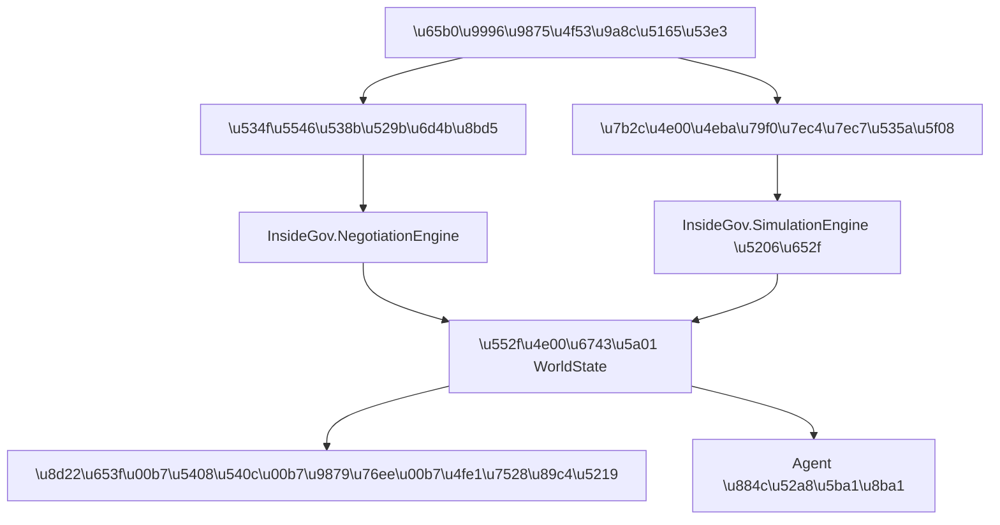

# InsideGov 公众体验适配层

## 定位

InsideGov 吸收了 G-E conversation agent 的组合式协商与事件可见性思路，以及 Novel agent 的第一人称角色体验思路。实现采用 clean-room 适配层，没有引入两个原型自带的第二套 `WorldState`、HTTP 服务、SQLite 世界或 LLM 世界裁定器。

公众体验与研究工作台采用明确的产品边界：

- 五个公众场景固定使用 DeepSeek LLM Agent，不提供确定性模式开关；
- 服务端没有 `DEEPSEEK_API_KEY` 时返回 503，不静默伪装为 AI 体验；
- 每次结果显示实际模型、Agent 审计数和结构化调用降级数；
- 只有研究工作台允许切换确定性基线、Flash 或 Pro，用于对照实验。



## 协商压力测试

三个二元维度组成 M1—M8：

- 直接受理 / 双方确认需求；
- 承诺后会商 / 承诺前会商；
- 模糊表态 / 书面附条件承诺。

用户输入一条项目异动。事件编译器只能转换已公开的小范围语义（融资、客户、治理、财政），并显示：

- 最初知情与未知主体；
- 可观察信号；
- 作用于权威世界的参数变化；
- 参数来源是用户条件还是 Demo 假设。

协商协议只约束必要程序。Agent 仍然自主决定查什么证据、如何披露、接受、还价还是退出。

## 第一人称组织博弈

每个会话使用一条普通 InsideGov 分支世界。玩家可以扮演招商局、财政局、市领导或产业园区。

```text
玩家选择角色动作
→ 从同一 ACTION_CATALOG 选择标准行为，或进入 propose_open_action
→ 由 ROLE_CAPABILITIES 与 GLOBAL_PROHIBITIONS 校验开放行动
→ 将合法请求注入下一个季度
→ 其他组织 Agent 同时基于各自信息行动
→ InsideGov 规则引擎结算
→ 返回角色可见叙事和规则执行回执
```

玩家不能直接输入补贴数字并修改财政，也不能看见其他组织未披露的私有信息。

## API

公众长流程统一从后台任务入口启动。创建任务后，网页只订阅事件，不再占用一次长时间 HTTP 请求：

```text
POST /experience/jobs
GET  /experience/jobs
GET  /experience/jobs/{job_id}
GET  /experience/jobs/{job_id}/events?after={sequence}
GET  /experience/jobs/{job_id}/stream?after={sequence}
GET  /experience/jobs/{job_id}/result
POST /experience/jobs/{job_id}/cancel
POST /experience/jobs/{job_id}/retry
```

任务、事件和检查点保存在 `.insidegov/public-jobs.sqlite3`。独立 worker 进程继续运行，关闭或刷新网页不会中断推演；API 重启后会检查心跳并恢复未完成任务。每完成一个安全季度或行动节点，权威世界快照就会写入 `WorldRepository`。重试会从快照复制一个新分支，原始过程保持不变。

事件流面向公众只展示“谁在做什么、为什么、世界发生了什么”。任务编号、心跳、模型诊断和事件序号折叠在“查看运行依据”中，避免把后台日志直接暴露成产品文案。

以下同步接口保留用于兼容已有研究脚本，公众首页不再直接调用：

```text
POST /experience/coordination
POST /experience/due-diligence
POST /experience/dynamic-competition
GET  /experience/conversation-mechanisms
POST /experience/conversations
GET  /experience/story-manifest
POST /experience/story-sessions
GET  /experience/story-sessions/{session_id}
POST /experience/story-sessions/{session_id}/actions
```

上述 POST 请求不接受 `policy_mode` 或 `model_name`。公众模型由服务端
`INSIDEGOV_PUBLIC_MODEL` 决定，默认 `deepseek-v4-flash`；模型选择权不会暴露到公众界面。

## 公众端交互原则

- 不显示无法解释的伪百分比，改用“准备—判断—协商—结算—说明”五段进程；
- 主舞台按时间显示 Agent 行动、理由和规则结算，用户无需理解日志字段；
- 页面可以离开，右下角任务抽屉持续显示运行状态，完成后在应用内提示；
- 取消采用安全停止，优先保存已完成世界节点；
- 失败信息用“哪一阶段没有完成、已保存什么、下一步能做什么”表达；
- 完成后才进入各场景专属结果页，不用同一种后端报告模板覆盖全部受众。

## 解释边界

- 公众叙事是权威状态的投影，不是第二次结算。
- 事件编译的 Demo 参数需在现实应用中经过人工确认和校准。
- 协商和故事输出用于程序压力测试、组织培训和机制教学，不是事实主体思想预测。
